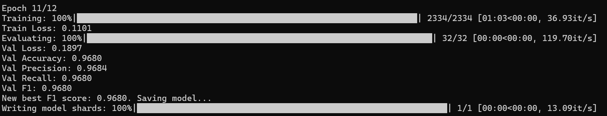

# How Do I Feel

Fine-tuning MiniLM-L6 for multi-class sentiment analysis on the Twitter entity sentiment dataset in [data/twitter_training.csv](data/twitter_training.csv) and [data/twitter_validation.csv](data/twitter_validation.csv).

The training script in [train.py](train.py) loads the dataset, maps sentiment labels to integer IDs, fine-tunes `sentence-transformers/all-MiniLM-L6-v2` with a classification head, evaluates on the validation split after every epoch, and saves the best checkpoint by weighted F1 score.

## Results

Latest reported validation result:

- Validation loss: `0.1897`
- Validation accuracy: `0.9680`
- Validation precision: `0.9684`
- Validation recall: `0.9680`
- Validation F1: `0.9680`



## Project Structure

```text
.
├── assets/
│   └── eval.png
├── data/
│   ├── twitter_training.csv
│   └── twitter_validation.csv
├── models/
│   └── minilm-sentiment/
├── requirements.txt
└── train.py
```

## Environment Setup

Create and activate a virtual environment, then install dependencies:

```powershell
python -m venv venv
.\venv\Scripts\Activate.ps1
pip install -r requirements.txt
```

If you already have an active environment, only run the install step.

## Training

Start training with:

```powershell
python train.py
```

The current script uses these fixed settings:

- Model: `sentence-transformers/all-MiniLM-L6-v2`
- Epochs: `12`
- Batch size: `32`
- Learning rate: `2e-5`
- Max sequence length: `128`
- Output directory: `models/minilm-sentiment`

## What Gets Saved

After training, the best checkpoint is saved in [models/minilm-sentiment](models/minilm-sentiment) with:

- `model.safetensors`
- `config.json`
- `tokenizer.json`
- `tokenizer_config.json`
- `label_mapping.json`
- `training_history.json`

## Dataset Format

The CSV files are expected to contain four columns with no header row:

1. `topic_id`
2. `topic`
3. `sentiment`
4. `text`

Example row:

```csv
2401,Borderlands,Positive,"im getting on borderlands and i will murder you all ,"
```

## Notes

- The label mapping is generated automatically from the training split.
- The script uses CUDA when available, otherwise it falls back to CPU.
- Validation metrics are computed with weighted precision, recall, and F1.
